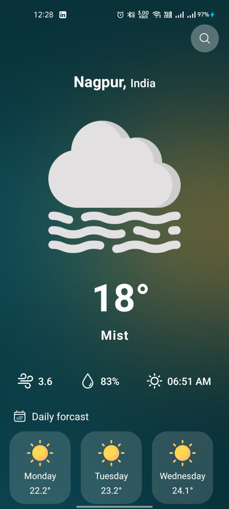
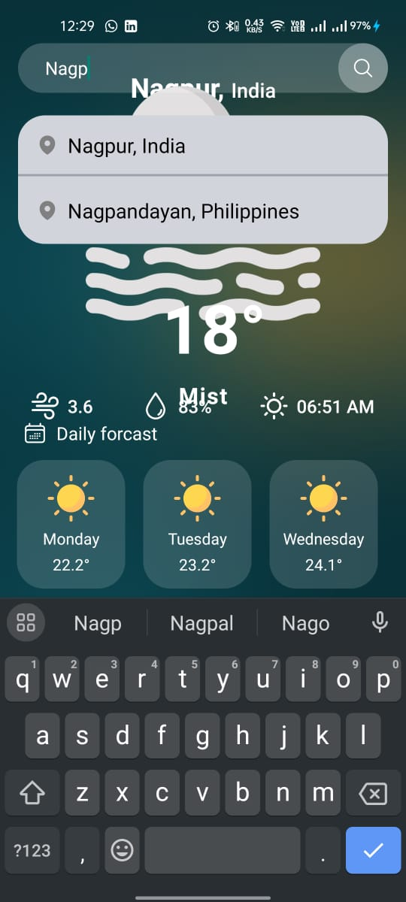

# Weather App

## Overview

The Weather App is a simple web application that provides real-time weather information based on user input. It utilizes the OpenWeatherMap API to fetch weather data and displays it in a user-friendly interface.

## Table of Contents

- [Installation](#installation)
- [Screenshots](#Screenshots)
- [Usage](#usage)
- [Features](#features)
- [Contributing](#contributing)
- [License](#license)

## Screenshots






## Installation

To run the Weather App locally, follow these steps:

1. Clone the repository:

   ```bash
   git clone https://github.com/bhupendrasambare/Weather-App.git
   ```

2. Navigate to the project directory:

   ```bash
   cd Weather-App
   ```

3. Install dependencies:

   ```bash
   npm install
   ```

4. Create a configuration file (`config.js`) in the root directory and add your OpenWeatherMap API key:

   ```javascript
   // config.js
   const config = {
     apiKey: 'YOUR_OPENWEATHERMAP_API_KEY',
   };

   module.exports = config;
   ```

   Replace `'YOUR_OPENWEATHERMAP_API_KEY'` with your actual API key.

5. Start the application:

   ```bash
   npm start
   ```

   The app will be accessible at `http://localhost:3000` by default.

## Usage

1. Open the Weather App in your web browser.

2. Enter the name of the city you want to get weather information for.

3. Click the "Get Weather" button.

4. The app will display real-time weather information for the specified city.

## Features

- Real-time weather information retrieval.
- User-friendly interface.
- Responsive design for various screen sizes.
- Supports a wide range of cities worldwide.

## Contributing

If you would like to contribute to the Weather App, please follow these guidelines:

1. Fork the repository.
2. Create a new branch for your feature or bug fix: `git checkout -b feature-name`.
3. Make your changes and commit them: `git commit -m "Description of changes"`.
4. Push your changes to the new branch: `git push origin feature-name`.
5. Open a pull request with a detailed description of your changes.

Please adhere to the existing coding style and conventions.

## License

This project is licensed under the MIT License - see the [LICENSE](LICENSE) file for details.

---